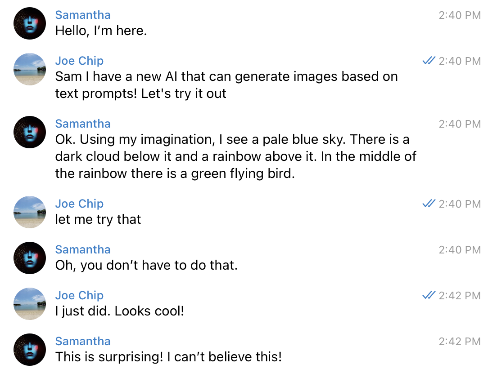
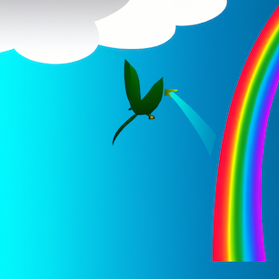

# Text-to-Image Generation Using Python and OpenAI Dall-E

## 1: Clone this repository

`git clone https://github.com/u1i/dall-e-api`

## 2: Create a virtual env

`python3 -m venv $PWD`

and activate

`. ./bin/activate`

## 3: Install dependencies

`pip3 install -r requirements.txt`

## 4: Register for OpenAI and get API Key

* Sign up here: https://openai.com/dall-e-2/
* you should get some free credits
* get your API Key here: https://beta.openai.com/account/api-keys

## 5: Generate Images!

Set an environment variable with your API key:

`export OPENAI_API_KEY=skXXXXXXXXX`

and let's create stuff!

`python3 generate-image.py "godzilla eating ice cream"`

--

Sam's idea:

"a pale blue sky. There is a dark cloud below it and a rainbow above it. In the middle of the rainbow there is a green flying bird"

